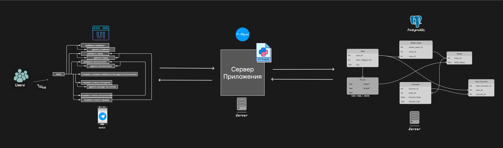
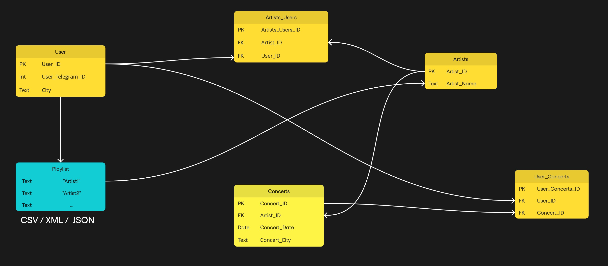

<h1 align="center">🎵 концерт.пошли</h1>

<div align="center">


</div>

---

<p align="center">
  ➡️➡️ <strong>Отчёт по проделанной работе к КТ-2</strong> ⬅️⬅️  
  <br><br>
  📄 <a href="./REPORT.md"><strong>Посмотреть отчёт</strong></a>
</p>

---


## 📄 Описание проекта

*Концерт.пошли* — это Telegram бот, который принимает ссылку на плейлист из Яндекс.Музыки, анализирует его, извлекает информацию о музыкантах, собирает информацию о предстоящих концертах этих музыкантов, формирует и отправляет график концертов пользователю Telegram.

## 🎯 Функциональность

### 1. Анализ плейлиста
Бот получает ссылку на плейлист из Яндекс.Музыки, анализирует его и извлекает данные о музыкантах, которые в нем представлены.

### 2. Сбор информации о концертах
Используя API Яндекс.Афиши и Яндекс.Музыки, бот собирает информацию о предстоящих концертах этих музыкантов.

### 3. Формирование графика
Бот формирует расписание всех ближайших концертов и отправляет его пользователю через Telegram (или другим выбранным способом).


## 🖥️ Пользовательский интерфейс (UI)

### Отправка ссылки
Пользователь вводит команду и отправляет ссылку на плейлист из Яндекс.Музыки. Бот анализирует плейлист и сохраняет музыкальные предпочтения пользователя для последующих рекомендаций и уведомлений.

### Получение расписания концертов
Бот присылает расписание концертов с информацией о местах проведения, датах и времени.

## 🏛️ Архитектура системы



### Пользователи
Пользователи взаимодействуют с ботом через Telegram. Их команды передаются в интерфейс бота посредством Telegram API.

### Сервер приложения
Сервер приложения — центральный компонент системы. Он принимает запросы от Telegram-бота, обрабатывает их и взаимодействует с базой данных для выполнения необходимых действий.

### База данных PostgreSQL
Хранит данные о пользователях, плейлистах, исполнителях и концертах.


## 🏗️ База данных



| Таблица              | Описание                                                                                                     |
|----------------------|----------------------------------------------------------------------------------------------------------------|
| **User**             | Хранит данные пользователей: уникальный идентификатор пользователя (user_id), Telegram ID (user_telegram_id), город (city). |
| **Artist**           | Список исполнителей, включая их уникальный идентификатор (artist_id) и имя исполнителя (artist_name).          |
| **Concert**          | Информация о концертах, таких как идентификатор концерта (concert_id), дата (concert_date), город (concert_city), название (concert_title), место (place), адрес (address) и URL афиши (afisha_url). |
| **Artists_Users**    | Таблица для связи пользователей с их любимыми исполнителями: идентификатор связи (artists_users_id), идентификаторы пользователя (user_id) и исполнителя (artist_id). |
| **Artists_Concerts** | Таблица для связи исполнителей с их концертами: идентификатор исполнителя (artist_id) и идентификатор концерта (concert_id). |
| **UserConcerts**     | Информация о концертах, которые интересуют пользователей: идентификатор связи (user_concerts_id), идентификаторы пользователя (user_id) и концерта (concert_id), а также идентификатор загрузки (upload_id). |


## ⚙️ Внутренняя логика и начинка

- **AIOGRAM**: Асинхронная обработка запросов пользователей и работа с Telegram API.
- **PostgreSQL**: Управление базой данных для быстрого доступа к информации о концертах.
- **SQLAlchemy**: Использование ORM SQLAlchemy для удобной работы с данными.
- **Интеграция с Яндекс Музыкой**: Извлечение информации о плейлистах и исполнителях.
- **Уведомления**: Автоматическая система оповещений о новых концертах или изменениях в расписании.

## Устройство кода**
```plaintext
📂 TelegramBot/  
│  
├── 📁 .idea/  
│   Конфигурационные файлы для IDE.  
│  
├── 📁 app/  
│   Основная логика приложения.  
│   ├── 📁 migrations/  
│   │   Папка для миграций базы данных.  
│   ├── 📁 tests/  
│   │   Тесты для парсера и бота.  
│   ├── .env  
│   │   Конфигурационный файл с переменными окружения.  
│   ├── config.py  
│   │   Настройки приложения (токены, переменные окружения).  
│   ├── constants.py  
│   │   Константы и параметры, используемые в приложении.  
│   ├── aux_functions.py  
│   │   Вспомогательные функции для бота и приложения.  
│   ├── db_editor.py  
│   │   Функции для работы с базой данных (CRUD).  
│   ├── handlers.py  
│   │   Обработка сообщений и взаимодействий с пользователем.  
│   ├── keyboards.py  
│   │   Генерация клавиатур для взаимодействия с ботом.  
│   ├── main.py  
│   │   Точка входа в приложение.  
│   ├── models.py  
│   │   Модели данных (пользователи, концерты, исполнители).  
│   └── music_parser.py  
│       Парсинг данных из музыкальных сервисов (например, Yandex Music).  
│  
├── requirements.txt  
│   Список зависимостей проекта.  
├── .gitignore  
│   Файл для исключения определённых файлов и папок из репозитория Git.  
├── docker-compose.yml  
│   Конфигурация для запуска проекта через Docker Compose.  
├── Dockerfile  
│   Файл для создания Docker-контейнера.  
└── LICENSE.chromedriver  
    Лицензионное соглашение для ChromeDriver.  

```


## 👥 Команда разработчиков

| Валерий Убушаев 💻 | Роберт Чеченов 💻 | Сулейман Лугма 💻 | Арслан Батталов 💻 |
|:----------------:|:--------------:|:--------------:|:---------------:|
| [@flw1n](https://t.me/flw1n)<br>Развертывание БД, ORM SQLAlchemy<br>Разработчик | [@roberto_roz](https://t.me/roberto_roz)<br>Часть функционала, обработка взаимодействия с пользователем (плейлисты, исполнители)<br>Разработчик | [@lsuleimanl](https://t.me/lsuleimanl)<br>Связь с Яндекс Афишей (парсинг/api)<br>Разработчик | [@young_pin1](https://t.me/young_pin1)<br>Создание и развертывание бота, часть функционала<br>Разработчик |
